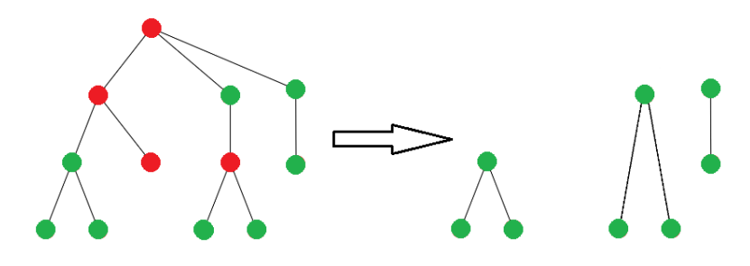

# Overview  
The aim of the project was to create a program that allows the creation of phylogenetic trees from the data provided. The data are FASTA files containing biological sequences and their associated descriptions (country, date of collection, sample ID). During tree creation it was assumed that a sample taken later cannot be an ancestor of a sample taken earlier.  
The programme provides the following functionalities:  
-loading sample and sequence information from a .fasta file  
-creation of an optimal phylogenetic tree from a given list of samples and sequences  
-"filtering" the tree by country of sampling  
-fast construction of a low cost tree (but not necessarily optimal)  
A simple measure of the similarity of two sequences is the edit distance. It is the minimum number of insertions, deletions and substitutions (operations of adding any character, deleting any character or replacement of any character by another) needed to obtain one sequence from the other.  
The cost of a phylogenetic tree is defined as follows: for each node (except the root), we count the edit distance between it and its parent and sum all these values. For a given list of samples and sequences, the optimal phylogenetic tree is the least cost tree in which all sequences from the list occur and the date of the parent's sample is always earlier than of the child. It can take a long time to create an optimal tree. Therefore, the goal of the project was also to create heuristics that can quickly create a tree with low cost, but not necessarily optimal.  

It was also important to ensure that the time complexity of the solutions was appropriate. A suitably adapted Needleman-Wunschs algorithm was used to calculate the edit distance between sequences.  
## Filtering
Filtering by country returns a list of new trees according to the following scheme:  
(green - samples from the requested country)  

## Approximate tree algorithm
The algorithm depends on the parameters, the data entered and some random factor.  
For each sample, we try to find the sample in the tree with the smallest edit distance from it. When we find it, we add the current sample as a child of the found sample.  
We start from the root. The edit distance from it is checked. Then the edit distance from its children is checked.  
The mandatory_check_branches parameter determines what happens when the root has the best edit distance for the sample.  
If it is set to False, the sample is added to the root. If True, the best matching branch + *limit_of_additional_draws* number of random branches will be checked.
Checking a branch is searching through the subtree, looking for the best match. When checking subsequent children, we only go to the one that has a better or equal edit distance. If there is no such one, we stop. That is, we simply go down the branch of the tree until we find the best match in it.  
If limit_of_additional_draws > 0, then in addition to the best branch, a corresponding number of other randomly selected branches are also checked.  

